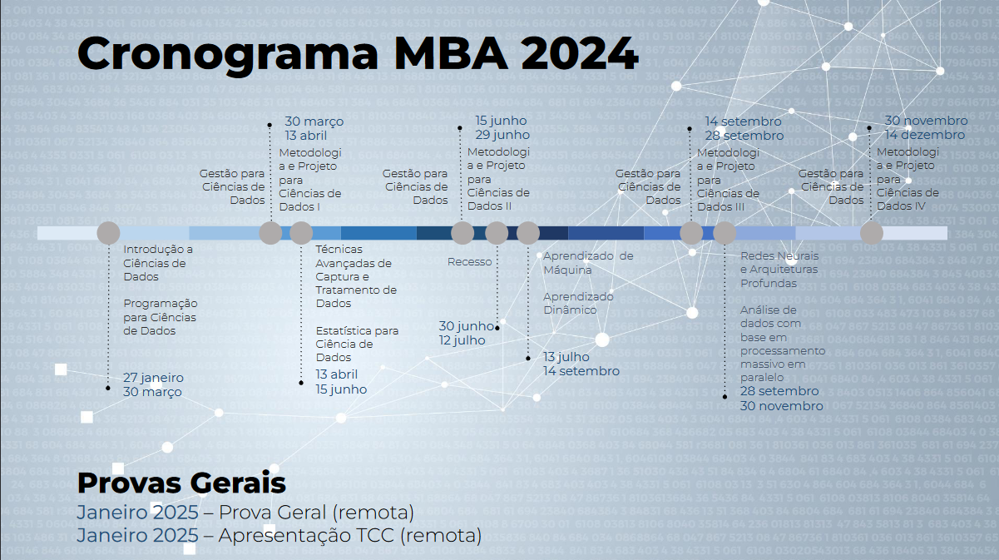

# Repositório do Curso de MBA em Ciência de Dados - ICMC USP

Bem-vindo ao repositório do curso de MBA em Ciência de Dados oferecido pelo Instituto de Ciências Matemáticas e de Computação (ICMC) da Universidade de São Paulo (USP).

Este repositório foi criado para organizar e compartilhar materiais, códigos, projetos e anotações relacionadas ao conteúdo do curso, abrangendo técnicas avançadas de análise de dados, aprendizado de máquina, estatística, visualização, e ferramentas computacionais amplamente utilizadas na área de ciência de dados.

Formação profissionais capacitados em metodologias e técnicas necessárias e adequadas para manipulação, visualização, análise, modelagem e interpretação de grandes e complexas massas de dados, provenientes dos mais variados setores e áreas de aplicação.

